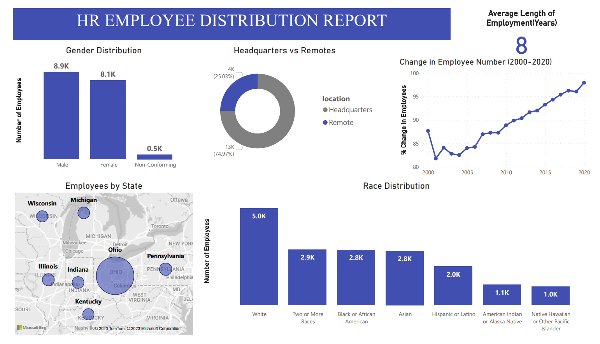
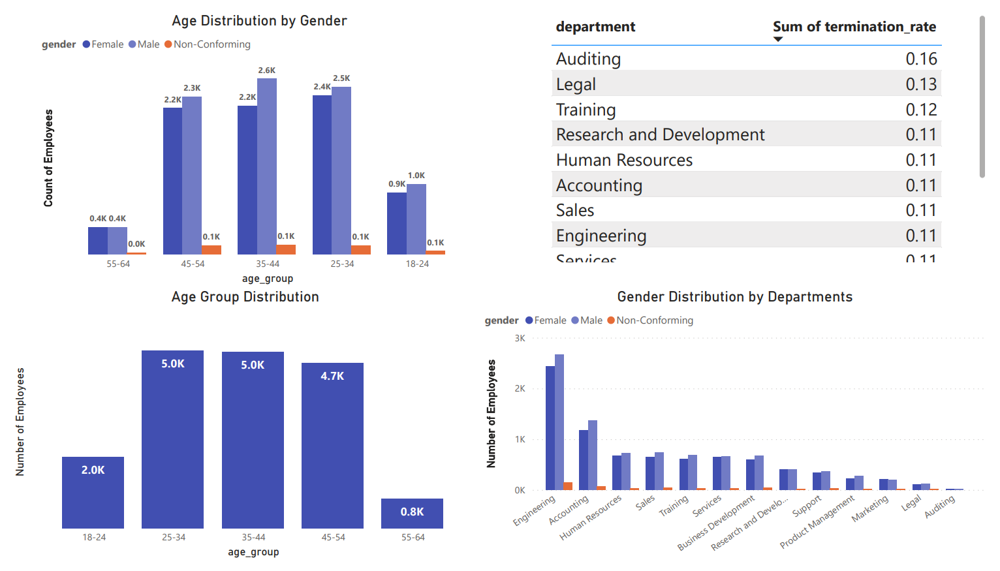

# HR-Dashboard_MySQL_PowerBI

Page 1 :

Page 2 :

## Data Used
#### Data - HR Data with over 22000 rows from the year 2000 to 2020.
#### Data Cleaning & Analysis - MySQL Workbench
#### Data Visualization - PowerBI

## Limitations
- Some records had negative ages and these were excluded during querying(967 records). Ages used were 18 years and above.
- Some termdates were far into the future and were not included in the analysis(1599 records). The only term dates used were those less than or equal to the current 
  date.
